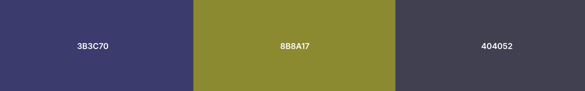
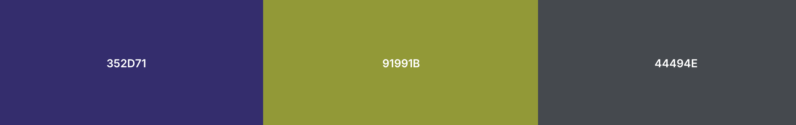
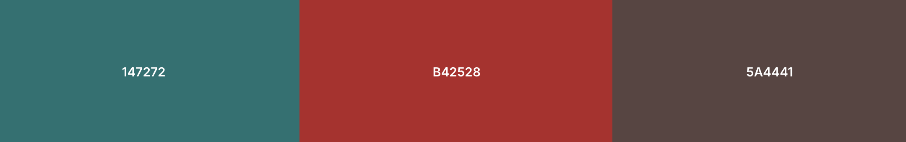
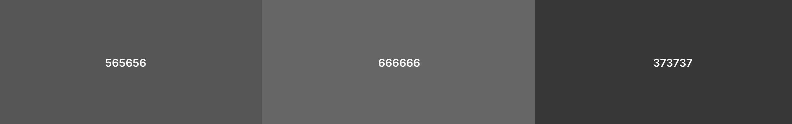

import AccessibleModal from '@site/src/components/AccessibleModal';

# 🎨 Choix des couleurs du dashboard

## Distinction claire entre **Achievables**, **Offers** et **Realized**, avec une accessibilité garantie pour tous

Le tableau de bord repose sur trois indicateurs fondamentaux du pilotage commercial :

- **Achievables** – ce que l’on doit atteindre  
- **Offers** – ce qui a été proposé aux clients  
- **Realized** – ce qui a effectivement été vendu  

Pour permettre une lecture **immédiate**, **universelle**, et **non ambiguë**, nous avons défini une palette spécialement choisie pour être robuste face aux différents types de daltonisme (protanopie, deutéranopie, tritanopie et achromatopsie).

---

# 1. 🎯 Palette officielle du dashboard

| Indicateur      | Couleur     | Nom          | Rôle                             | Raisons du choix                                                                                                                                                                  |
| --------------- | ----------- | ------------ | -------------------------------- | --------------------------------------------------------------------------------------------------------------------------------------------------------------------------------- |
| **Achievables** | **#0F766F** | Deep Ocean   | C'e que l’on doit atteindre      | Une teinte bleu-vert très stable dans les simulations de daltonisme, facilement différenciable du orange et du violet. Fonctionne en vision altérée car sa luminosité est unique. |
| **Offers**      | **#BA4E06** | Autumn Ember | Ce qui a été proposé aux clients | Un orange profond, perçu comme distinct dans tous les daltonismes, y compris en protanopie (rouge/vert). Ce choix évite la confusion avec les teintes bleu-vert ou violettes.     |
| **Realized**    | **#5E1B64** | Deep Purple  | Ce qui a effectivement été vendu | Un violet sombre, extrêmement identifiable et rarement altéré dans les confusions colorimétriques classiques. Son contraste avec les deux autres couleurs reste excellent.        |

---

# 2. 🔍 Pourquoi ces trois couleurs fonctionnent si bien ensemble ?

<AccessibleModal buttonLabel="Couleurs et variantes">
## Couleurs standard

## Protanopie

## Deutéranopie

## Tritanopie

## Achromatopsie

</AccessibleModal>

### ✔️ 1. Elles ne se confondent pas même en cas de daltonisme sévère

Dans les tests :

- **Protanopie & Deutéranopie**  
  
  - L’orange (#BA4E06) conserve sa luminosité et se distingue nettement du bleu-vert (#0F766F).  
  - Le violet (#5E1B64) reste isolé car il se situe dans une zone chromatique peu impactée.

- **Tritanopie**  
  
  - Le vert-bleu et l’orange restent très différenciés.  
  - Le violet apparaît plus sombre, donc identifiable par contraste.

- **Achromatopsie**  
  
  - Les trois teintes conservent trois **niveaux de luminosité différents**, ce qui garantit une différenciation même en vision quasi noir-et-blanc.

### ✔️ 2. Elles expriment trois intentions différentes

- **Achievables (#0F766F)** → objectif, stabilité, référence  
- **Offers (#BA4E06)** → dynamisme, action commerciale  
- **Realized (#5E1B64)** → résultats consolidés, profondeur analytique  

### ✔️ 3. Elles restent agréables et non agressives pour un usage intensif

Les tableaux denses (type *By Crop*) nécessitent une palette :

- lisible,  
- non saturée,  
- non fatigante à l’œil,  
- adaptable aux exports papier ou PDF.  

Ces trois teintes respectent ces contraintes.

---

# 3. 🧭 Règles d’usage dans le dashboard

### ✔️ 1. Une couleur = un indicateur (jamais d’ambiguïté)

- **Achievables = #0F766F** uniquement  
- **Offers = #BA4E06** uniquement  
- **Realized = #5E1B64** uniquement  

---

### ✔️ 2. Toujours afficher la **légende explicite**

Pour éviter les mauvaises interprétations lors :

- d’exports  
- de captures d’écran  
- de présentations MS Teams  
- de relecture papier  

---

### ✔️ 3. Conserver le même ordre visuel partout

Ordre officiel :

1. **Achievables (vert-bleu)**  
2. **Offers (orange)**  
3. **Realized (violet)**  

---

# 4. 🧪 Résultats des tests d’accessibilité (résumé)

| Type de daltonisme | Résultat                                                                                 |
| ------------------ | ---------------------------------------------------------------------------------------- |
| **Protanopie**     | Aucun risque de confusion entre #0F766F et #BA4E06 ; #5E1B64 reste identifiable.         |
| **Deutéranopie**   | Les trois teintes restent distinctes grâce au contraste et à la luminosité.              |
| **Tritanopie**     | Les couleurs apparaissent moins saturées mais restent parfaitement différentiables.      |
| **Achromatopsie**  | La différenciation est assurée par la différence de luminosité entre les trois couleurs. |

➡️ **Conclusion : la palette est considérée comme robuste et accessible.**

---

# 5. 📘 Conclusion

Le choix des trois couleurs :

- **Achievables → #0F766F**  
- **Offers → #BA4E06**  
- **Realized → #5E1B64**

permet d’obtenir un système :

### ✔️ Accessible dans toutes les formes de daltonisme

### ✔️ Lisible dans les tableaux très denses

### ✔️ Cohérent avec l'expérience utilisateur des différentes versions (MVP, Germination, Moisson, Épi)

### ✔️ Stable et compréhensible pour tous les personae

C’est une palette à la fois **inclusive**, **fiable**, **pérenne** et **orientée décision**.
